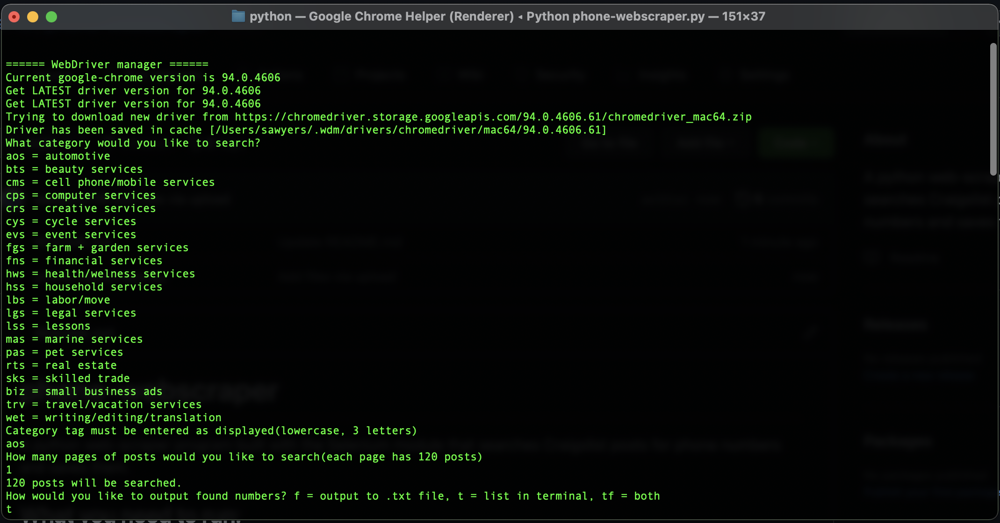
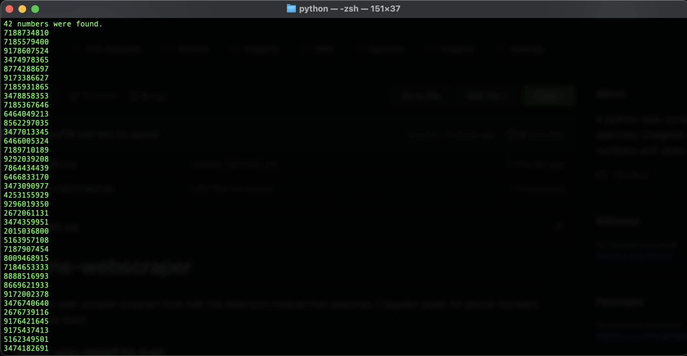

# phone-webscraper
A python web-scraper program built with the Selenium module that searches Craigslist posts for phone numbers and saves them.

## What you need to run:
- python
- pip
- selenium installed (in terminal: "pip install selenium")

## How to use
Program runs in terminal. 

- Enter category of posts to be searched.
- Enter how many pages of posts to be searched(each is 120)
- Enter how you would like to output the found phone numbers
Image of inputs:

If you get an error now, that might mean the category you chose does not have enough posts.

Program will run, speed depends on strength of your internet connection.
Depending on what you chose previously, program will output list of phone numbers to file or terminal, or both.
Image of outputs:

Just a cool, practical thing I made in my free time
